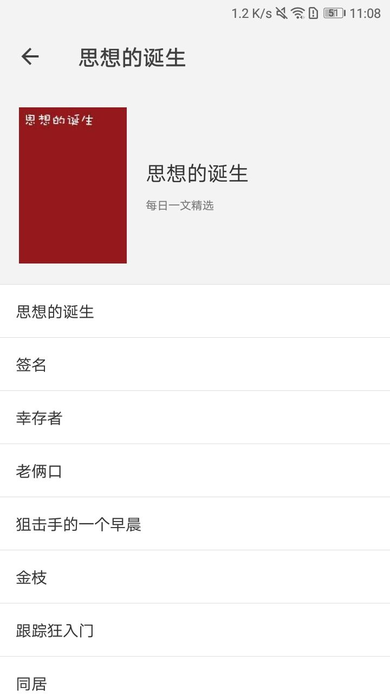

# 观止 (<a href="https://meiriyiwen.com/">每日一文</a>) 快应用

#### 项目说明
对每日一文这个网站的内容挺感兴趣，它的app 观止只提供了每日一文和随机一文功能，觉得可以拓展，于是写了个 [观止爬虫](https://github.com/evont/totheend-server) 抓取了它网站的数据，同时做了这个快应用当练手。
项目地址： [观止快应用](https://github.com/evont/toTheEnd) 

#### 项目使用
可以在根目录下 /dist/com.evont.goh.rpk 下载打包后的快应用

#### 项目截图

